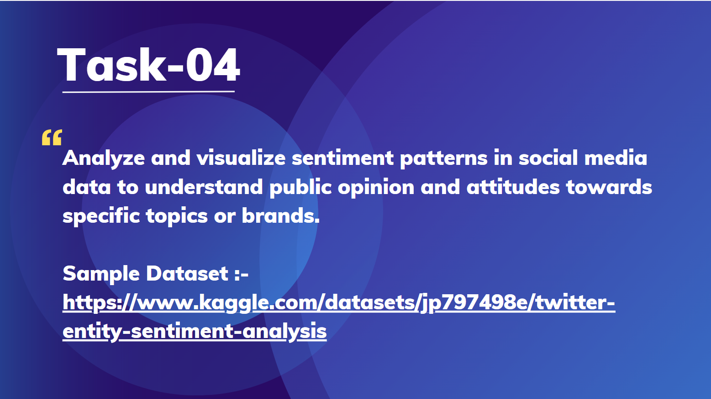

# TASK-4
Analyze and visualize sentiment patterns in social media data to understand public opinion and attitudes towards specific topics or brands.

# Prodigy InfoTech Data Science Internship Task 4
 

<!-- Welcome message for the task submission -->
Welcome to my submission for Task 4 of the Data Science Internship at Prodigy Infotech. In this task, I have performed sentiment analysis on social media data to understand public opinion and attitudes towards specific topics or brands.

## Dataset

<!-- Description of the dataset used for the analysis -->
The dataset used for this task is <a href="Dataset">Twitter_dataset</a>.The dataset used for this task contains social media posts related to specific topics/brands. The dataset includes text data, timestamps, and other metadata about each post.

## Tools and Libraries Used
<!-- Tools and libraries involved in the analysis -->
- Jupyter notebook
- Pandas
- Numpy
- NLTK (Natural Language Toolkit) for text processing
- Scikit-learn
- Matplotlib & Seaborn for visualizations

## Sentiment Analysis Process

<!-- Steps taken during the sentiment analysis process -->
During the analysis, I followed these steps:

1. **Data Preprocessing**: Cleaned the text data, removed stop words, punctuation, and handled missing values.
2. **Sentiment Classification**: Used a pre-trained sentiment analysis model (such as VADER or TextBlob) to classify each post as positive, negative, or neutral.
3. **Visualization**: Created charts to visualize sentiment distribution and analyzed trends over time to see how public opinion evolved regarding the topics/brands.

## Conclusion

<!-- Final summary and conclusions derived from the analysis -->
This sentiment analysis provided valuable insights into how the public feels about certain topics/brands. Understanding sentiment trends over time can help organizations better engage with their audience and make data-driven decisions.

Thank you for reviewing my submission!

## 📬 Contact

<!-- Contact information for inquiries or feedback -->
For any inquiries or feedback regarding this project, please contact:

- <a>[Pramod Doddmane](https://www.linkedin.com/in/pramoddr) (LinkedIn)</a>
- Email: pramoddoddmane@gmail.com
